# SimpleTimeService — Particle41 DevOps Challenge

>  **Heads up:** This deploys real AWS infrastructure that costs money. Don't forget to run `terraform destroy` when you're done or you'll get a bill at the end of the month.

---

## Overview

My submission for the Particle41 DevOps challenge. I built a small Node.js service, containerised it with Docker, pushed the image to DockerHub, then deployed everything on AWS using Terraform — VPC, load balancer, ECS Fargate, the works. I also wired up a GitHub Actions pipeline so deploys happen automatically on every push.

The service itself is simple by design. The challenge was never about the app — it's about getting it running properly in the cloud with real infrastructure around it.

---

## The App

Single endpoint: `GET /`

Returns:
```json
{
  "timestamp": "2026-04-08T06:45:00.000Z",
  "ip": "203.0.113.42"
}
```

One thing worth mentioning — the IP is pulled from the `X-Forwarded-For` header. Behind an ALB that header gets set to the actual client IP, so this works correctly in production rather than just returning the ALB's internal address.

The image is on DockerHub if you want to pull and test it directly:

```bash
docker pull shadab1995/particle41devopschallenge:latest
```

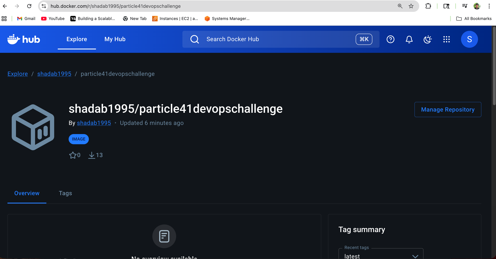

Quick local test:
```bash
docker run -p 3000:3000 shadab1995/particle41devopschallenge:latest
curl http://localhost:3000
```

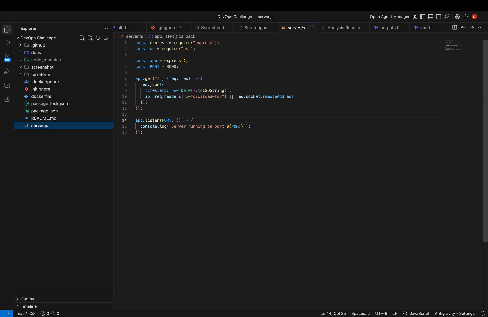

---

## Project Structure

```
.
├── server.js                        # The app
├── package.json
├── dockerfile
├── .dockerignore
├── .gitignore
├── .github/
│   └── workflows/
│       └── deploy.yml               # GitHub Actions CI/CD
├── docs/                            # Screenshots used in this README
│   ├── architecture.png
│   ├── cicd.png
│   ├── docker.png
│   ├── node.png
│   ├── action.png
│   ├── github-action.png
│   ├── deploy.png
│   ├── vpc.png
│   ├── plan.png
│   ├── terraform.png
│   ├── terraform-apply.png
│   ├── terraform-apply-yes.png
│   ├── terraform-destroy.png
│   └── github-secrets.png
└── terraform/
    ├── provider.tf
    ├── vpc.tf                       # VPC, subnets, IGW, routing
    ├── alb.tf                       # ALB, target group, listener, security group
    ├── ecs.tf                       # ECS cluster, task, service, security group
    └── outputs.tf
```

---

## Architecture

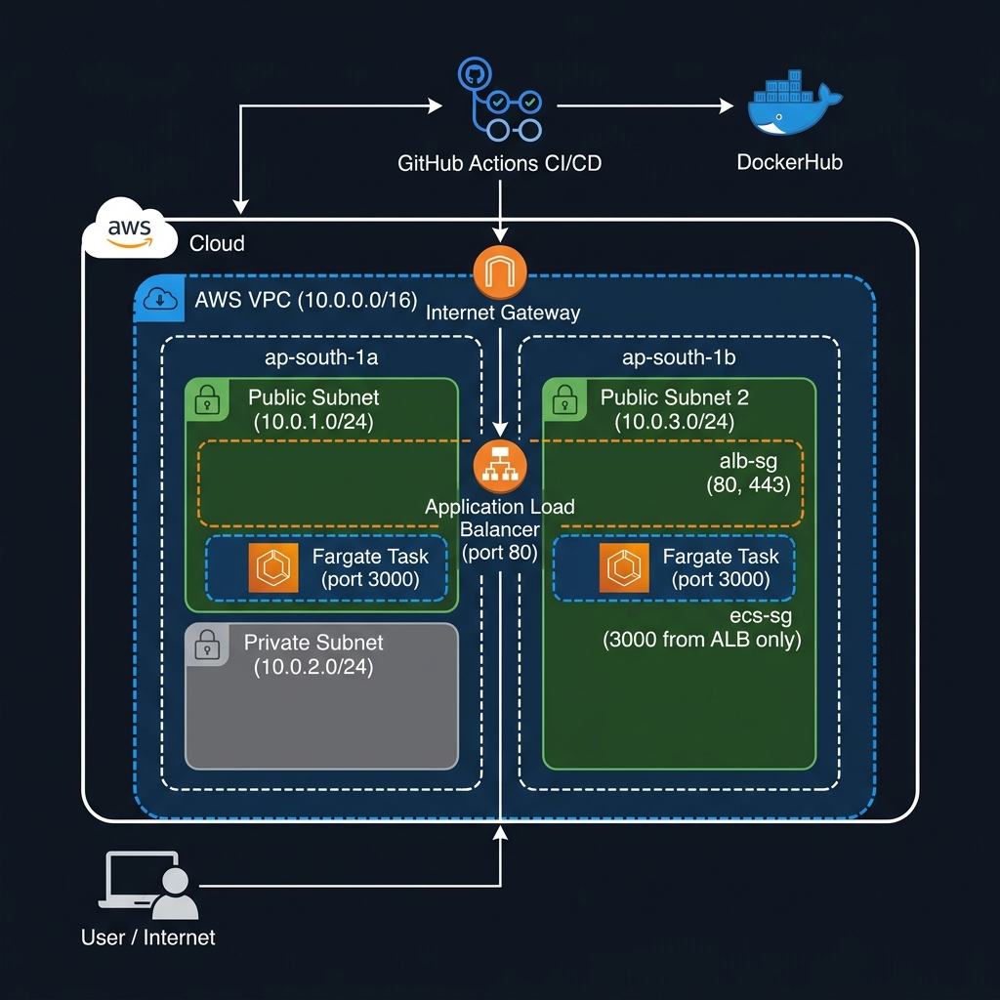

I chose **ECS Fargate + ALB** over EKS or plain EC2 for a few reasons. Kubernetes is overkill for a single stateless service — you end up managing more infrastructure than the app itself. EC2 means patching and managing instances. Fargate hits the sweet spot: you get container-based deployments without the node management overhead.

The ALB sits in two public subnets across different AZs and forwards traffic to the Fargate task on port 3000. The ECS security group only allows inbound on port 3000 from the ALB security group — so there's no way to hit the container directly from the internet, only via the load balancer.

**Network setup:**

| Layer | Details |
|---|---|
| VPC | `10.0.0.0/16` |
| Public Subnet 1 | `10.0.1.0/24` — `ap-south-1a` |
| Public Subnet 2 | `10.0.3.0/24` — `ap-south-1b` |
| Private Subnet | `10.0.2.0/24` — `ap-south-1a` |

Traffic path:
```
User → Internet Gateway → ALB (port 80) → ECS Task (port 3000)
```

Here's how the VPC looks in the AWS console after deploying:

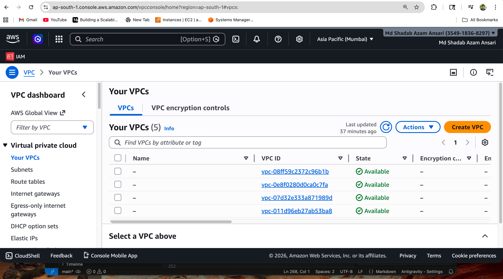

---

## Prerequisites

Make sure you have these installed:

| Tool | Link |
|---|---|
| Terraform >= 1.0 | [Install](https://developer.hashicorp.com/terraform/install) |
| AWS CLI v2 | [Install](https://docs.aws.amazon.com/cli/latest/userguide/install-cliv2.html) |
| Docker (optional, for local testing) | [Install](https://docs.docker.com/get-docker/) |
| Git | [Install](https://git-scm.com/downloads) |

You'll also need an AWS account with an IAM user that has permissions for EC2, VPC, ECS, and ELBv2.

---

## AWS Credentials Setup

Don't commit credentials anywhere near this repo. The `.gitignore` already covers `.tfstate` and `.terraform/` but the most important rule is: no keys in code.

**Using AWS CLI:**

```bash
aws configure
```

Fill in your access key, secret, region (`ap-south-1`), and output format (`json`).

**Or with environment variables if you prefer:**

```bash
export AWS_ACCESS_KEY_ID="your_key"
export AWS_SECRET_ACCESS_KEY="your_secret"
export AWS_DEFAULT_REGION="ap-south-1"
```

Check it worked:
```bash
aws sts get-caller-identity
```

If you see your account ID come back, you're good. Terraform automatically picks up whatever credentials the AWS CLI is configured with.

---

## Deploying

All the Terraform files are in the `terraform/` directory. Run everything from there.

---

### 1. Clone the repo

```bash
git clone https://github.com/sazamansari/Particle41-.git
cd Particle41-
```

---

### 2. `terraform init`

This pulls down the AWS provider and sets up the local working directory.

```bash
cd terraform
terraform init
```

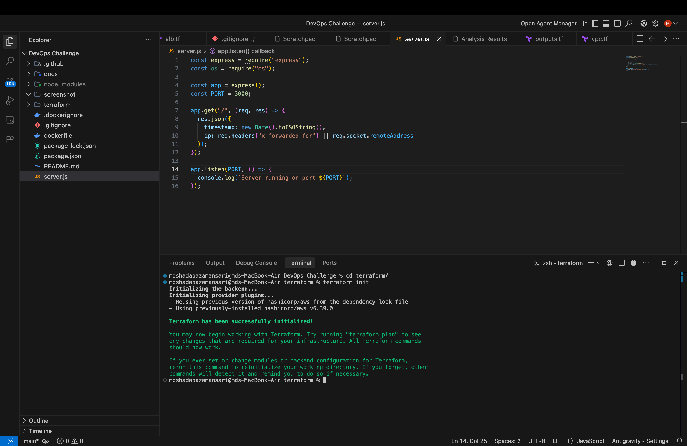

---

### 3. `terraform plan`

Run a plan first so you know exactly what's going to be created. You should see around 17 resources — VPC, subnets, IGW, route tables, security groups, ALB, target group, listener, ECS cluster, task definition, and service.

```bash
terraform plan
```

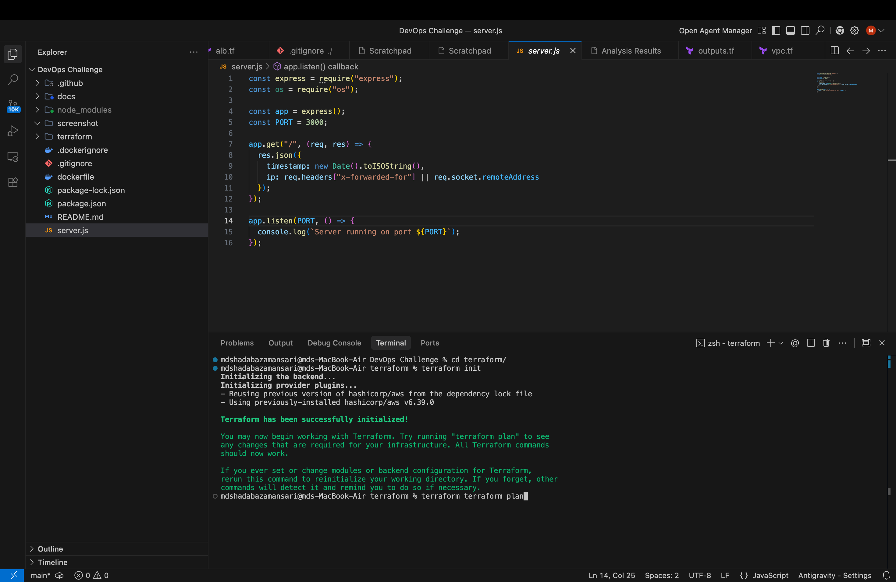

---

### 4. `terraform apply`

```bash
terraform apply
```

Terraform will print the plan again and ask you to confirm. Type `yes`.

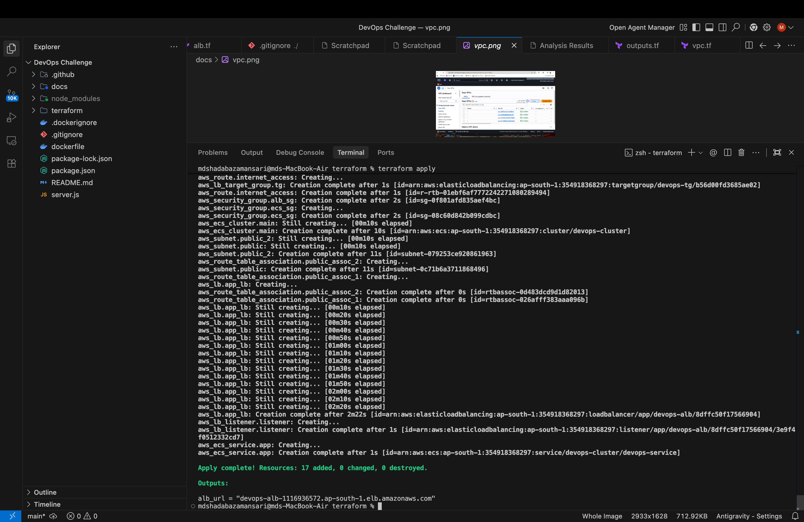

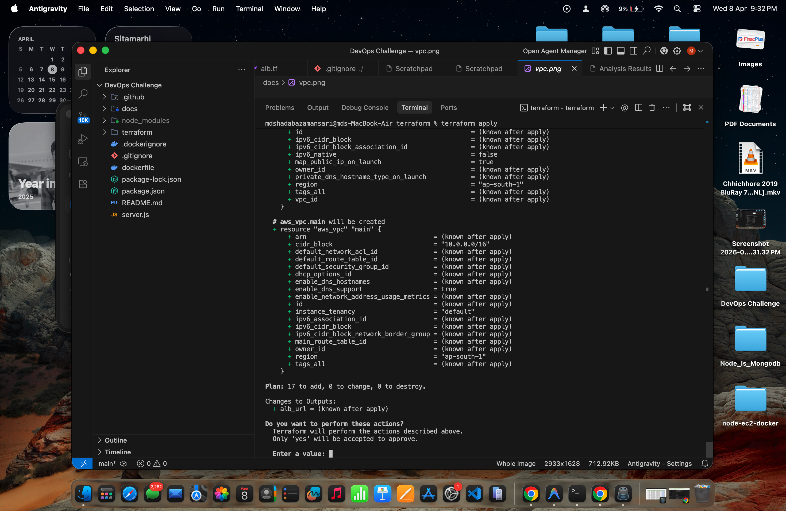

Give it 3–5 minutes. Most of that wait is the ALB coming up.

---

### 5. Test the app

When apply finishes, grab the ALB URL from the output:

```bash
terraform output alb_url
```

Paste it in a browser or `curl` it:

```bash
curl http://<alb_url>
```

You should get something like:

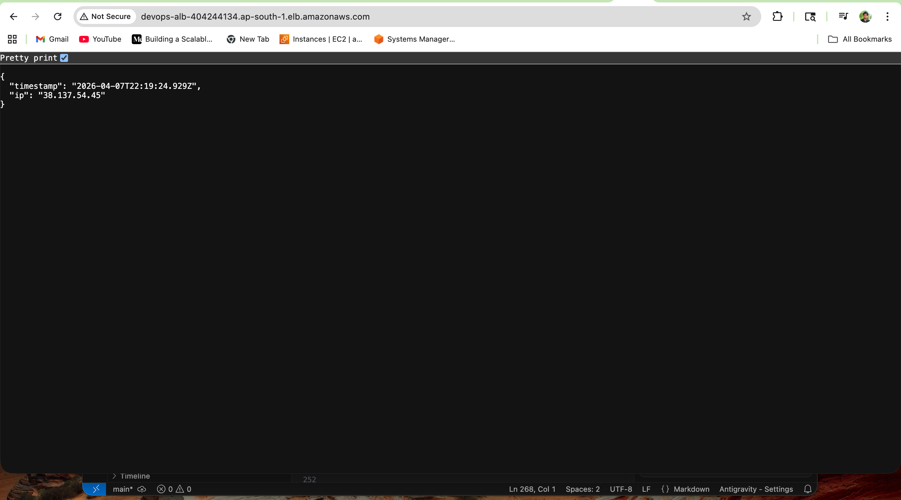

```json
{
  "timestamp": "2026-04-07T22:19:24.929Z",
  "ip": "38.137.54.45"
}
```

---

### 6. Clean up

When you're done, make sure you destroy the infrastructure:

```bash
terraform destroy
```

Type `yes`. Everything gets removed.

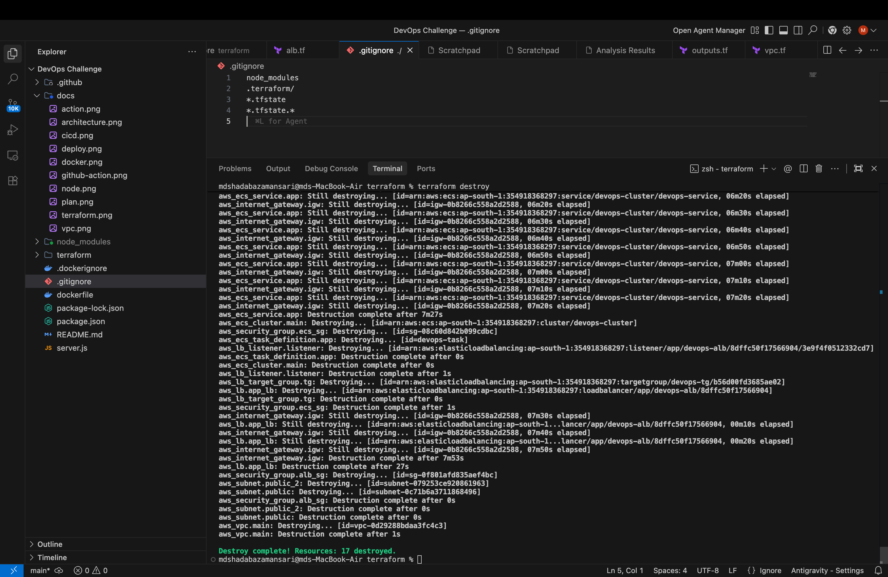

---

## CI/CD Pipeline

I set up GitHub Actions to handle builds and deploys automatically. Every push to `main` runs the full pipeline — build the image, push to DockerHub, then run `terraform apply` on AWS.

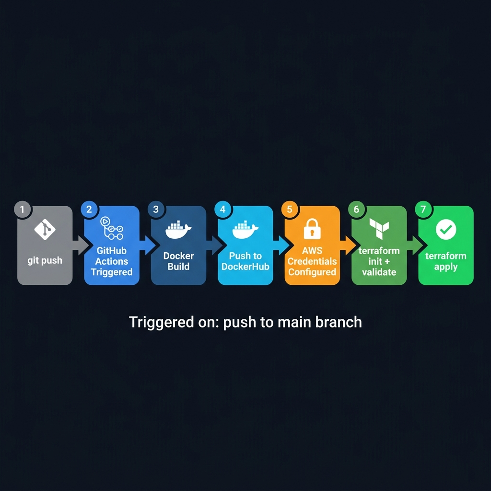

Steps in the pipeline:

1. Checkout code
2. Build Docker image
3. Login to DockerHub, tag and push the image
4. Configure AWS credentials
5. `terraform init`
6. `terraform validate`
7. `terraform apply -auto-approve`

A successful run in GitHub Actions:

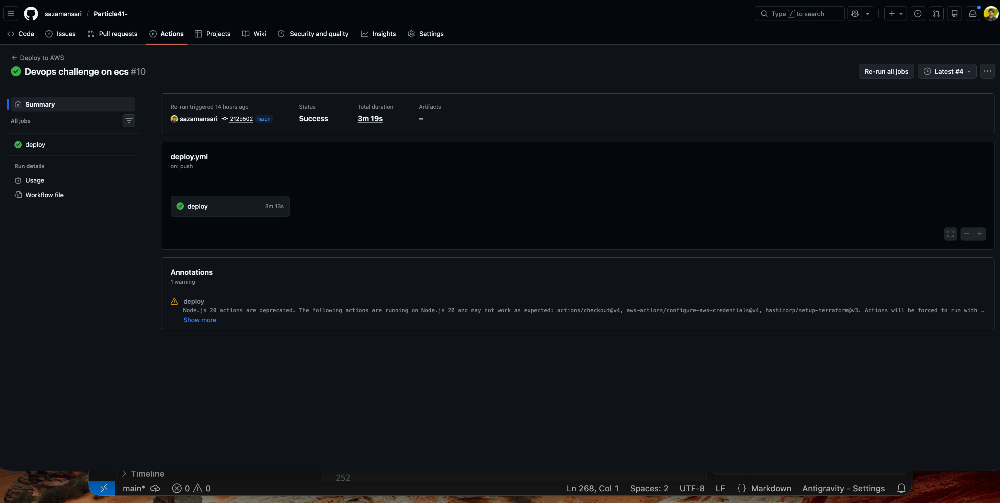

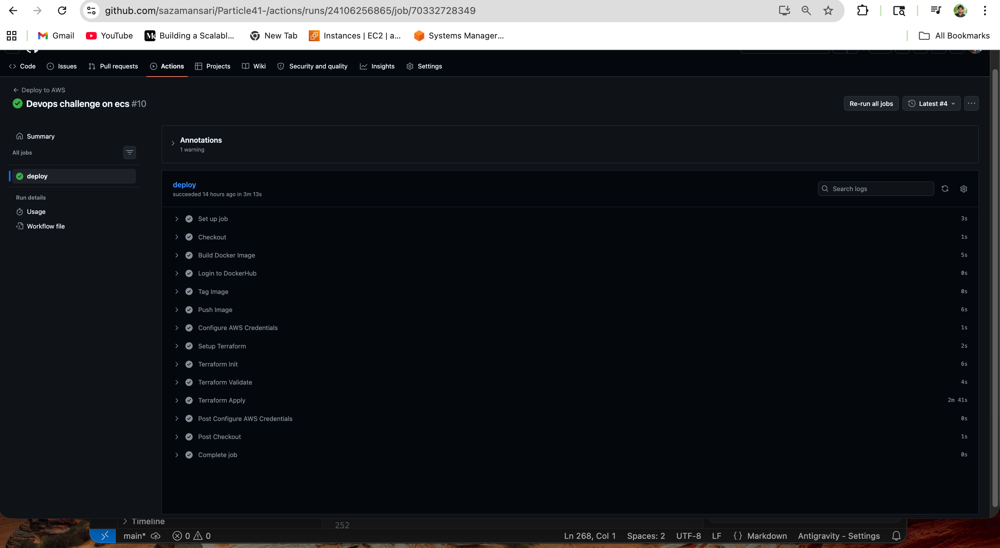

**To set it up in your own fork**, add these four secrets under **Settings → Secrets and variables → Actions**:

| Secret | Value |
|---|---|
| `DOCKER_USER` | DockerHub username |
| `DOCKER_PASS` | DockerHub password or access token |
| `AWS_ACCESS_KEY_ID` | IAM access key |
| `AWS_SECRET_ACCESS_KEY` | IAM secret key |

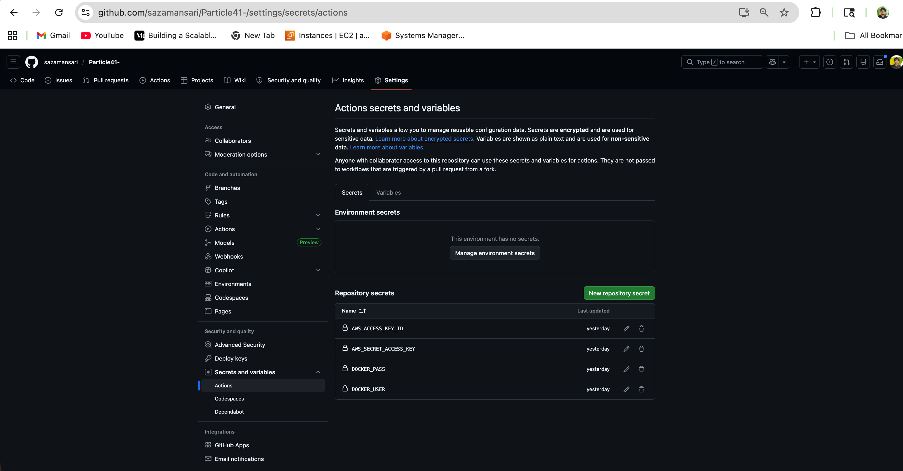

After that's done, any push to `main` triggers the full deployment automatically.

---

## Running Locally Without Docker

```bash
npm install
npm start
```

Server starts on port 3000. Hit `http://localhost:3000` to test.

---

## Docker Notes

The image uses `node:alpine` as the base to keep the size down. The container also runs as a non-root user (`appuser`) — created inside the Dockerfile — which is a security requirement from the spec and generally just good practice.

`node_modules` is excluded from the Docker build context via `.dockerignore`, so you're not accidentally copying platform-specific binaries from your local machine into the image.

---

## What I'd Do Differently With More Time

A few things I'd want to clean up if this were going to production:

- **Remote state backend** — Right now `terraform.tfstate` is local. If the pipeline runs on GitHub Actions and the state isn't shared, it'll try to recreate resources that already exist. An S3 bucket with DynamoDB locking fixes this.
- **NAT Gateway for private subnets** — The ECS tasks currently run in public subnets with a public IP so they can pull from DockerHub. The cleaner approach is private subnets + a NAT Gateway for outbound traffic.
- **IAM Execution Role for ECS** — The task definition doesn't have an `execution_role_arn`, which means it has no permissions to pull from ECR or write to CloudWatch Logs. Works for public DockerHub images but would break with ECR.
- **CloudWatch Logs** — Without a log configuration in the container definition, there's no way to see what the application is doing at runtime.
- **Auto scaling** — `desired_count = 1` is fine for testing but you'd want to hook up Application Auto Scaling in a real environment.

---

**Md Shadab Azam Ansari**
